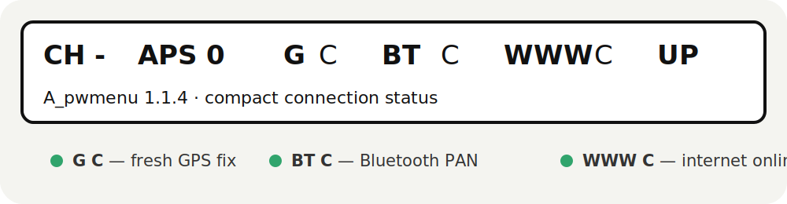
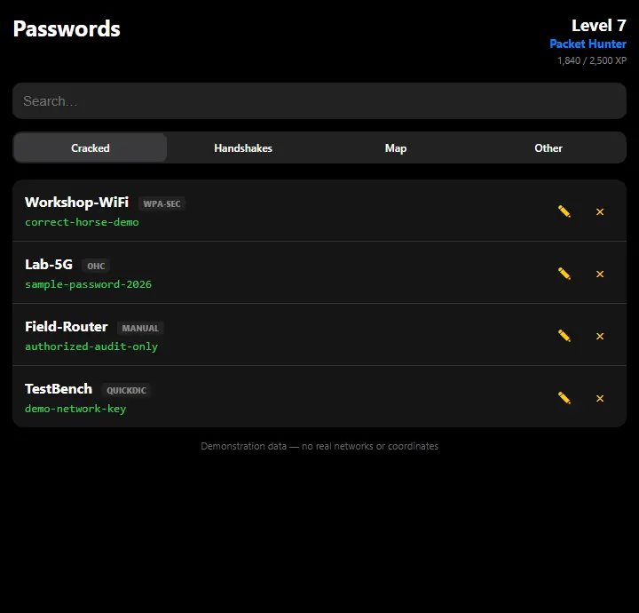
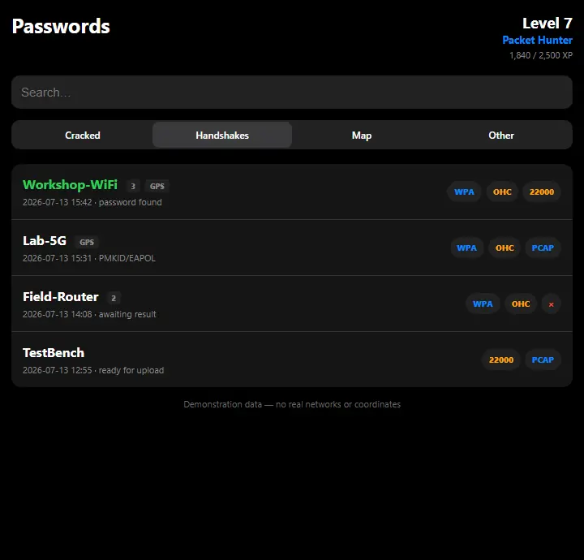
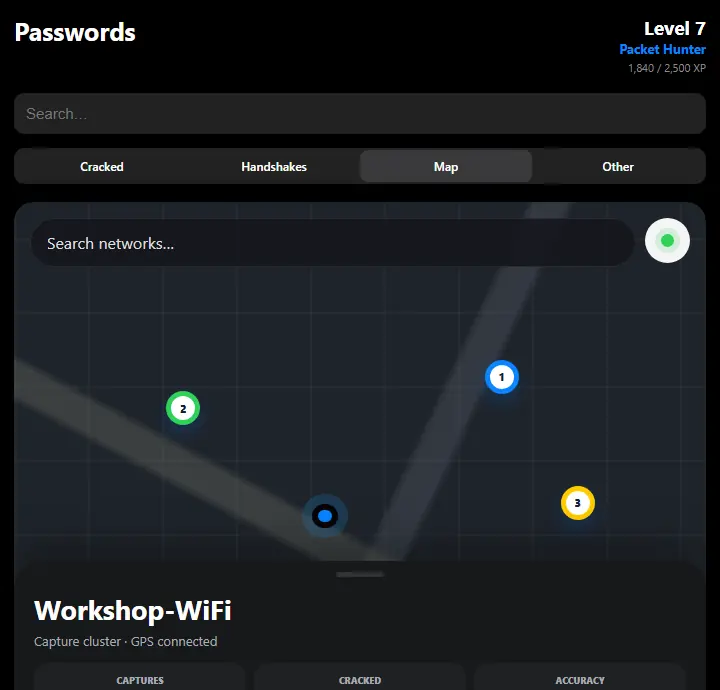
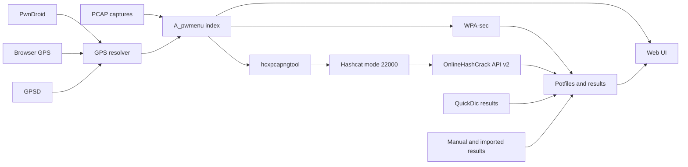

# A_pwmenu

An advanced Pwnagotchi handshake and password manager with a mobile-friendly web interface, GPS-aware capture indexing, map visualization, WPA-sec integration, OnlineHashCrack API v2 support, exports, imports, and a compact on-device GPS status indicator.

[](./CHANGELOG.md)
[](./LICENSE)

<p align="center">
  
</p>

<table>
  <tr>
    <td width="33%" align="center"><br><sub>Password manager</sub></td>
    <td width="33%" align="center"><br><sub>Handshake actions</sub></td>
    <td width="33%" align="center"><br><sub>GPS capture map</sub></td>
  </tr>
</table>

> [!IMPORTANT]
> Use this plugin only with networks you own or have explicit permission to audit. Uploading third-party captures or hashes without authorization may violate the law and the terms of the connected services.

## Table of contents

- [Highlights](#highlights)
- [How it works](#how-it-works)
- [Compatibility and requirements](#compatibility-and-requirements)
- [Installation](#installation)
- [Quick start](#quick-start)
- [Complete configuration reference](#complete-configuration-reference)
- [Obtaining API keys](#obtaining-api-keys)
- [Web interface](#web-interface)
- [WPA-sec integration](#wpa-sec-integration)
- [OnlineHashCrack integration](#onlinehashcrack-integration)
- [GPS and PwnDroid](#gps-and-pwndroid)
- [On-device GPS indicator](#on-device-gps-indicator)
- [Files and persistent data](#files-and-persistent-data)
- [Backup and restore](#backup-and-restore)
- [Security](#security)
- [Troubleshooting](#troubleshooting)
- [HTTP routes](#http-routes)
- [Updating and uninstalling](#updating-and-uninstalling)
- [License](#license)

## Highlights

### Capture management

- Scans `.pcap` captures in both `/root/handshakes/` and `/home/pi/handshakes/`.
- Groups captures by ESSID and BSSID.
- Separates cracked networks from captures that still require processing.
- Downloads individual PCAP files.
- Converts PCAP files to Hashcat mode 22000 with `hcxpcapngtool`.
- Downloads all captures as a ZIP archive.
- Downloads only uncracked captures as a ZIP archive.
- Downloads selected geographic clusters as ZIP archives.
- Deletes an individual PCAP and its local `.22000` or `.hc22000` derivatives.
- Detects captures that do not contain usable PMKID/EAPOL material.
- Includes an explicit Danger Zone for complete local capture cleanup.

### Password and result aggregation

A_pwmenu merges results from several sources:

- WPA-sec potfiles.
- Imported OnlineHashCrack results.
- Manually entered passwords.
- QuickDic `*.pcap.cracked` files.

The web interface can:

- Display the source of each password.
- Add a password manually.
- Update a local password.
- Delete a local password.
- Import OHC JSON or CSV exports.
- Export a combined text list.
- Track capture and crack statistics.
- Maintain XP, levels, and achievements.

### WPA-sec and OnlineHashCrack

- Separate actions and handlers for WPA-sec and OHC.
- Single-file and cluster submission to WPA-sec.
- Background WPA-sec cluster uploads that do not block the web request.
- Local PCAP-to-22000 extraction for OHC.
- OHC batches of up to 50 hashes.
- OHC `list_tasks` synchronization.
- Local tracking of reported hashes and source PCAP files.
- Handling of `accepted`, `skipped`, and `rejected` API buckets.
- Persistent OHC rate-limit backoff.
- `Retry-After` handling for HTTP 429 responses.
- A failed batch stops the current upload cycle instead of hammering the API.
- Persistent file queue with automatic retry after backoff.
- Signature-aware rescanning when an existing PCAP receives new handshake data.
- One-click reconciliation that sends every local hash missing from the OHC task list.

### GPS and map support

- PwnDroid GPS over WebSocket.
- Browser Geolocation API support.
- GPSD fallback support.
- Automatic Bluetooth phone gateway discovery from its MAC address.
- GPS sidecar creation when a new handshake is captured.
- Existing `.gps.json`, `.geo.json`, and compatible JSON sidecar discovery.
- GPS age and stale-fix tracking.
- Map search and filtering.
- Capture history grouping.
- Geographic clustering.
- A dedicated list of networks without GPS coordinates.
- `G C` / `G -` status on the physical Pwnagotchi display.

### Reliability and hardening

- Atomic JSON state writes with `fsync()` and `os.replace()`.
- Backup state snapshots and parent-directory `fsync()` for sudden power-loss recovery.
- Locks around shared state, GPS data, and upload workers.
- `SpooledTemporaryFile` archives to avoid storing large ZIP files entirely in RAM.
- Unique temporary conversion outputs.
- Configurable `hcxpcapngtool` timeout.
- No `shell=True` usage.
- No user-controlled shell command construction.
- Strict capture filename validation.
- Path traversal rejection.
- HTTP 404 responses for unsafe or missing download paths.
- HTML and JavaScript escaping for capture filenames.
- Configurable import size limit.

## How it works



When Pwnagotchi creates a handshake, A_pwmenu asks the GPS resolver for a recent fix. If one is available, the plugin writes a GPS sidecar next to the capture. When automatic OHC submission is enabled, the new capture is queued for OHC processing.

When the web page opens, the plugin scans capture directories and result files, builds a unified data model, updates persistent metadata, and renders the capture list, map, statistics, and available actions.

Live GPS source priority is:

1. PwnDroid WebSocket.
2. Browser-provided coordinates.
3. GPSD.

GPSD polling is cached. An unavailable local GPSD daemon therefore does not block every display refresh.

## Compatibility and requirements

A_pwmenu 1.1.2 has been developed and tested with:

- Pwnagotchi 2.x, including Jayofelony-based images.
- Python 3.11 from the Pwnagotchi virtual environment.
- The Pwnagotchi Flask web UI.
- `requests`.
- `websockets` for PwnDroid support.
- `hcxpcapngtool` from the `hcxtools` package.
- Internet access for WPA-sec, OHC, time synchronization, and Yandex Maps.

Verify the Python dependencies:

```bash
/home/pi/.pwn/bin/python3 -c \
  "import requests, websockets; print('Python dependencies OK')"
```

Verify `hcxpcapngtool`:

```bash
/usr/bin/hcxpcapngtool --version
```

Install `hcxtools` if necessary:

```bash
sudo apt update
sudo apt install -y hcxtools
```

Install `websockets` into the Pwnagotchi environment if it is missing:

```bash
sudo /home/pi/.pwn/bin/pip install websockets
```

## Installation

### Install the current release directly from GitHub

```bash
sudo wget -O /usr/local/share/pwnagotchi/custom-plugins/A_pwmenu.py \
  https://raw.githubusercontent.com/newfpv/pwmenu/v1.1.2/A_pwmenu.py
```

Continue with the syntax check and configuration steps below. Pinning the release tag keeps the installed code reproducible; replace `v1.1.2` only when intentionally upgrading.

### 1. Back up an existing version

```bash
sudo cp \
  /usr/local/share/pwnagotchi/custom-plugins/A_pwmenu.py \
  /root/A_pwmenu.py.backup
```

Skip this command if the plugin is not installed yet.

### 2. Copy the plugin

```bash
sudo cp A_pwmenu.py \
  /usr/local/share/pwnagotchi/custom-plugins/A_pwmenu.py

sudo chown root:root \
  /usr/local/share/pwnagotchi/custom-plugins/A_pwmenu.py

sudo chmod 644 \
  /usr/local/share/pwnagotchi/custom-plugins/A_pwmenu.py
```

The filename must remain exactly `A_pwmenu.py` so the plugin loader can discover it.

### 3. Check the Python syntax

```bash
/home/pi/.pwn/bin/python3 -m py_compile \
  /usr/local/share/pwnagotchi/custom-plugins/A_pwmenu.py
```

No output means compilation succeeded.

### 4. Enable the plugin

Add this line to `/etc/pwnagotchi/config.toml`:

```toml
main.plugins.A_pwmenu.enabled = true
```

### 5. Restart Pwnagotchi

```bash
sudo systemctl restart pwnagotchi
sudo systemctl status pwnagotchi --no-pager
```

### 6. Open the plugin

```text
http://<PWNAGOTCHI-IP>:8080/plugins/A_pwmenu/
```

The common USB address is:

```text
http://10.0.0.2:8080/plugins/A_pwmenu/
```

To find the current Bluetooth PAN address:

```bash
ip -4 addr show bnep0
```

For example, if `bnep0` has `192.168.44.2/24`, open:

```text
http://192.168.44.2:8080/plugins/A_pwmenu/
```

The address assigned by Android can change after Bluetooth tethering reconnects.

## Quick start

The following configuration enables WPA-sec, OHC, and PwnDroid without embedding device-specific values in the plugin itself:

```toml
main.plugins.A_pwmenu.enabled = true

main.plugins.A_pwmenu.wpa_sec_key = "REPLACE_WITH_WPA_SEC_KEY"

main.plugins.A_pwmenu.ohc_enabled = true
main.plugins.A_pwmenu.ohc_api_key = "sk_REPLACE_WITH_OHC_API_KEY"
main.plugins.A_pwmenu.ohc_auto_upload = true
main.plugins.A_pwmenu.ohc_receive_email = "yes"
main.plugins.A_pwmenu.ohc_sync_interval = 3600

main.plugins.A_pwmenu.pwndroid_ws_enabled = true
main.plugins.A_pwmenu.pwndroid_mac = "AA:BB:CC:DD:EE:FF"
main.plugins.A_pwmenu.pwndroid_gateway = ""
main.plugins.A_pwmenu.pwndroid_extra_gateways = ""
main.plugins.A_pwmenu.pwndroid_port = 8080

main.plugins.A_pwmenu.phone_gps_enabled = true
main.plugins.A_pwmenu.phone_gps_max_age = 600
main.plugins.A_pwmenu.gps_assign_window = 180
main.plugins.A_pwmenu.gps_stale_seconds = 180

main.plugins.A_pwmenu.gpsd_enabled = false

main.plugins.A_pwmenu.timezone = 3
main.plugins.A_pwmenu.time_sync_interval = 1800
```

If A_pwmenu manages automatic OHC uploads, disable the separate OHC uploader to avoid duplicate submissions and unnecessary HTTP 429 responses:

```toml
main.plugins.ohcapi.enabled = false
```

The standard WPA-sec plugin may remain enabled for its normal automatic submission and result-download workflow. A_pwmenu adds manual submission controls for selected files and clusters.

## Complete configuration reference

| Option | Type | Default | Description |
|---|---:|---:|---|
| `enabled` | bool | `false` | Enables A_pwmenu through the Pwnagotchi plugin loader. |
| `wpa_sec_key` | string | empty | Personal WPA-sec key. WPA buttons are hidden when this value is empty. |
| `ohc_enabled` | bool | `true` | Enables the built-in OnlineHashCrack integration. |
| `ohc_api_key` | string | empty | OHC private API v2 key. It should use the `sk_` prefix. |
| `ohc_auto_upload` | bool | `true` | Starts the OHC worker when internet becomes available and when a new handshake is captured. |
| `ohc_sync_interval` | int | `3600` | Minimum interval between OHC `list_tasks` synchronization attempts, in seconds. |
| `ohc_receive_email` | string | `yes` | Requests OHC email notification when supported by the account and API. |
| `ohc_retry_poll_interval` | int | `60` | Maximum scheduler sleep while a persistent OHC queue is waiting, in seconds. |
| `ohc_reconcile_on_start` | bool | `false` | Forces a complete local-versus-server hash reconciliation after every plugin start. |
| `pwndroid_ws_enabled` | bool | `true` | Enables the PwnDroid WebSocket GPS client. |
| `pwndroid_mac` | string | empty | Bluetooth MAC address of the phone, used to discover its current PAN gateway address. |
| `pwndroid_gateway` | string | empty | Explicit phone IP. Leave empty for dynamic gateway discovery. |
| `pwndroid_extra_gateways` | string/list | empty | Additional candidate phone IP addresses. A comma-separated string or TOML list is accepted. |
| `pwndroid_port` | int | `8080` | PwnDroid WebSocket port. |
| `phone_gps_enabled` | bool | `true` | Accepts coordinates submitted by the browser page. |
| `phone_gps_max_age` | int | `600` | Maximum age of a live GPS fix, in seconds. |
| `gps_assign_window` | int | `180` | Maximum time difference between a PCAP timestamp and a live fix before assignment. |
| `gps_stale_seconds` | int | `180` | Age after which capture coordinates are marked stale. |
| `gpsd_enabled` | bool | `true` | Enables GPSD as a fallback source. |
| `gpsd_host` | string | `127.0.0.1` | GPSD hostname or IP address. |
| `gpsd_port` | int | `2947` | GPSD port. |
| `gpsd_poll_interval` | int | `10` | Minimum time between GPSD connection attempts, in seconds. |
| `timezone` | int | `0` | Hour offset used when formatting capture timestamps. |
| `time_sync_interval` | int | `1800` | Background system time synchronization interval, in seconds. |
| `import_max_bytes` | int | `2097152` | Maximum accepted JSON or CSV upload size. |
| `archive_memory_limit` | int | `2097152` | Maximum archive or converted-output size retained in RAM before spooling to disk. |
| `hcxpcapngtool_timeout` | int | `90` | Maximum duration of a single conversion or validation process, in seconds. |

### GPSD example

```toml
main.plugins.A_pwmenu.gpsd_enabled = true
main.plugins.A_pwmenu.gpsd_host = "127.0.0.1"
main.plugins.A_pwmenu.gpsd_port = 2947
main.plugins.A_pwmenu.gpsd_poll_interval = 10
```

### Multiple PwnDroid gateway candidates

```toml
main.plugins.A_pwmenu.pwndroid_gateway = ""
main.plugins.A_pwmenu.pwndroid_extra_gateways = "192.168.44.1,192.168.50.1"
```

The plugin removes duplicate candidates and tries the remaining addresses in order.

## Obtaining API keys

### WPA-sec

1. Open the [WPA-sec key page](https://wpa-sec.stanev.org/?get_key=).
2. Enter a valid email address.
3. Follow the validation link sent by the service.
4. Copy the issued key into your configuration:

```toml
main.plugins.A_pwmenu.wpa_sec_key = "YOUR_WPA_SEC_KEY"
```

The same WPA-sec key can be reused for multiple uploads. It identifies your submissions and allows you to access their results.

### OnlineHashCrack

1. Create or open an OnlineHashCrack account.
2. Open [API management](https://www.onlinehashcrack.com/apimgt).
3. Create a private API v2 key.
4. Confirm that the key starts with `sk_`.
5. Store it in the Pwnagotchi configuration:

```toml
main.plugins.A_pwmenu.ohc_api_key = "sk_REPLACE_WITH_YOUR_KEY"
```

API documentation: [OnlineHashCrack Private API v2](https://www.onlinehashcrack.com/how-developpers-api-documentation.php).

> [!CAUTION]
> Never publish real API keys in a README, issue, screenshot, support log, or Git repository. If a key reaches Git history, revoke and rotate it. Removing it only from the latest commit is not sufficient.

## Web interface

### Cracked

The Cracked tab displays the unified password database. Each entry includes its source:

- `WPA-Sec`.
- `OHC`.
- `Manual`.
- `QuickDic`.

Available operations include:

- Revealing and copying a password.
- Updating a local password.
- Deleting a local password.
- Locating the associated capture records.

### Handshakes

The Handshakes tab groups capture files and shows:

- BSSID.
- Capture time.
- File size.
- GPS availability.
- Crack status.
- OHC status.

Per-file actions:

- `WPA` submits the original PCAP to WPA-sec.
- `OHC` extracts mode 22000 hashes and queues them through the OHC integration.
- `22000` performs a local conversion and downloads the result.
- `PCAP` downloads the source capture.
- `×` deletes the source and local derivative files.

### Map

The Map tab combines stored sidecar data with live GPS information.

- Repeated captures of the same ESSID/BSSID within 30 meters are combined into history.
- Different networks within 8 meters are combined into a geographic cluster.
- `Cracked` filters the map to cracked networks.
- `No GPS` lists captures without coordinates.
- `Stats` shows map-level totals.
- Individual points and clusters can be downloaded or submitted independently to OHC and WPA-sec.

Yandex Maps requires internet access. If the external map API does not load, A_pwmenu keeps its internal marker representation instead of losing the indexed GPS data.

### Other

The Other tab contains:

- The **Send all missing to OHC** reconciliation action, persistent queue size, and retry countdown.
- Achievements, level, and XP.
- Capture and crack statistics.
- Combined password export.
- ZIP download of every capture.
- ZIP download of uncracked captures.
- JSON and CSV import.
- Manual time synchronization.
- Invalid-capture cleanup.
- The destructive Danger Zone.

## WPA-sec integration

A_pwmenu sends original PCAP files to:

```text
https://wpa-sec.stanev.org/
```

The personal key is passed as the `api_key` query parameter. Cluster uploads run sequentially in a dedicated daemon thread, so the initiating web request can return immediately.

Results produced by the standard WPA-sec plugin are read from:

```text
/root/handshakes/wpa-sec.cracked.potfile
/home/pi/handshakes/wpa-sec.cracked.potfile
```

If the standard `wpa-sec` plugin is enabled, it may continue handling automatic uploads and result downloads. A_pwmenu provides additional manual selection, cluster submission, and result visualization.

## OnlineHashCrack integration

For an OHC submission, A_pwmenu:

1. Finds uncracked PCAP files.
2. Runs local `hcxpcapngtool` with a unique temporary output file.
3. Removes empty lines and duplicate mode 22000 hashes.
4. Synchronizes existing OHC tasks when the configured interval has elapsed.
5. Excludes already reported hashes.
6. Splits new hashes into batches of up to 50.
7. Sends them with `algo_mode = 22000`.
8. Records the relationship between each hash and its source PCAP.
9. Persists API status, PCAP signatures, the upload queue, and rate-limit state.
10. Automatically resumes queued work after `Retry-After` expires.

A PCAP that grows after an earlier submission is extracted again. Previously submitted hashes remain deduplicated, while newly appended handshake material is queued normally.

Possible local OHC states:

| State | Meaning |
|---|---|
| `sent` | The task was accepted by OHC. |
| `already_reported` | The hash already existed or was skipped as a duplicate. |
| `invalid` | OHC rejected the format or algorithm. |
| `failed` | Extraction, network communication, or the API call failed. |
| `found` | A synchronized task reports that a result is available. |
| `queued` | The file is durably queued until connectivity and rate limits allow processing. |

### HTTP 429 and backoff

`429 rate_limit_exceeded` does not mean the plugin is broken. A_pwmenu saves the next allowed attempt and every pending file in its state, suppresses API calls until that time, and automatically resumes the queue afterward.

Inspect OHC log entries:

```bash
grep -E 'OHC|A_pwmenu' \
  /etc/pwnagotchi/log/pwnagotchi.log | tail -100
```

Do not enable two automatic OHC uploaders at the same time:

```toml
main.plugins.A_pwmenu.ohc_auto_upload = true
main.plugins.ohcapi.enabled = false
```

## GPS and PwnDroid

PwnDroid is an Android companion application that can expose the phone's GPS data to Pwnagotchi. Current PwnDroid setup instructions are available in the [Jayofelony Pwnagotchi wiki](https://github.com/jayofelony/pwnagotchi/wiki/Step-4-Customization).

### Recommended Bluetooth topology

```text
Android phone
  ├─ Bluetooth tethering / PAN gateway
  ├─ mobile internet
  └─ PwnDroid WebSocket :8080
          │
          ▼
Pwnagotchi bnep0
  ├─ dynamic IPv4 address
  ├─ default route through the phone
  └─ A_pwmenu GPS client
```

### Setup procedure

1. Pair the phone with Pwnagotchi.
2. Enable Bluetooth tethering on the phone.
3. Enable GPS/WebSocket sharing in PwnDroid.
4. Find the phone's Bluetooth MAC address:

```bash
bluetoothctl devices
```

5. Configure the MAC and leave the gateway empty:

```toml
main.plugins.A_pwmenu.pwndroid_mac = "AA:BB:CC:DD:EE:FF"
main.plugins.A_pwmenu.pwndroid_gateway = ""
main.plugins.A_pwmenu.pwndroid_port = 8080
```

With an empty `pwndroid_gateway`, A_pwmenu attempts to discover the phone through its MAC address, the ARP table, and the current default route. This is more reliable than hard-coding an address because Android may assign a different PAN subnet after reconnecting.

### Browser GPS

The Map page attempts to use the browser Geolocation API and submit coordinates to the `phone-gps` route. Many mobile browsers expose location only to secure contexts such as HTTPS. Consequently, browser GPS may be unavailable when the page is opened through a plain private `http://10.x.x.x` address. PwnDroid is normally the more reliable source in that situation.

### GPS sidecars

When a fresh fix is available, A_pwmenu creates a sidecar next to the capture:

```text
Network_BSSID.pcap
Network_BSSID.gps.json
```

Example:

```json
{
  "Latitude": 51.507400,
  "Longitude": -0.127800,
  "Altitude": 0,
  "Speed": 0,
  "Accuracy": 12.5,
  "Bearing": 0,
  "Timestamp": 1770000000,
  "CaptureTimestamp": 1770000001,
  "GPSAge": 1,
  "GPSStale": false,
  "Source": "pwndroid"
}
```

Review sidecars before sharing them. Real GPS files can reveal a home address or travel history.

## On-device GPS indicator

The display element follows the visual style of the standard Bluetooth and internet indicators:

| Display | State |
|---|---|
| `G C` | A recent GPS fix is available from PwnDroid, browser GPS, or GPSD. |
| `G -` | No recent coordinates are available. |

`G` uses the bold label font and the state uses the medium text font. The element is positioned immediately to the left of `BT`.

`G C` represents a valid, recent coordinate fix, not merely an open WebSocket. If PwnDroid is connected but Android is not providing a location, the display remains `G -`.

## Files and persistent data

### Capture directories

```text
/root/handshakes/
/home/pi/handshakes/
```

### Plugin files

| Path | Purpose |
|---|---|
| `/usr/local/share/pwnagotchi/custom-plugins/A_pwmenu.py` | Plugin source. |
| `/root/handshakes/.a_pwmenu_data.json` | XP, achievements, GPS index, OHC metadata, signatures, and persistent queue. |
| `/root/handshakes/.a_pwmenu_data.json.bak` | Crash-recovery snapshot written atomically before the primary state file. |
| `/root/handshakes/.a_pwmenu_data.json.tmp` | Atomic-write temporary file. It should not remain after a successful write. |
| `/root/handshakes/onlinehashcrack.cracked.potfile` | Imported OHC results. |
| `/root/handshakes/manual.potfile` | Manually managed passwords. |
| `*.gps.json` or `*.geo.json` | Capture coordinates. |
| `*.pcap.cracked` | QuickDic result files. |

### Local potfile format

```text
AP_MAC:CLIENT_MAC:ESSID:PASSWORD
```

Do not manually edit the state file while Pwnagotchi is running. If manual recovery is required:

```bash
sudo systemctl stop pwnagotchi
sudoedit /root/handshakes/.a_pwmenu_data.json
sudo systemctl start pwnagotchi
```

## Backup and restore

### Complete backup

```bash
sudo systemctl stop pwnagotchi

sudo tar -czf /root/a-pwmenu-backup.tar.gz \
  /usr/local/share/pwnagotchi/custom-plugins/A_pwmenu.py \
  /etc/pwnagotchi/config.toml \
  /root/handshakes

sudo systemctl start pwnagotchi
```

Remove API keys, passwords, PCAP files, and GPS data before sharing this archive.

### State-only backup

```bash
sudo cp \
  /root/handshakes/.a_pwmenu_data.json \
  /root/handshakes/.a_pwmenu_data.json.backup
```

### Restore state

```bash
sudo systemctl stop pwnagotchi

sudo cp \
  /root/handshakes/.a_pwmenu_data.json.backup \
  /root/handshakes/.a_pwmenu_data.json

sudo chown root:root \
  /root/handshakes/.a_pwmenu_data.json

sudo systemctl start pwnagotchi
```

## Security

### Enable web authentication

If other devices can reach the Pwnagotchi web server, enable web authentication:

```toml
ui.web.auth = true
ui.web.username = "change-me"
ui.web.password = "use-a-strong-password"
```

A_pwmenu inherits the Pwnagotchi web UI authentication and Flask-WTF CSRF handling. Do not expose port 8080 directly to the public internet.

### Keep secrets out of Git

Repository examples should contain placeholders only:

```toml
main.plugins.A_pwmenu.wpa_sec_key = "REPLACE_ME"
main.plugins.A_pwmenu.ohc_api_key = "sk_REPLACE_ME"
main.plugins.A_pwmenu.pwndroid_mac = "AA:BB:CC:DD:EE:FF"
```

Recommended `.gitignore`:

```gitignore
config.toml
*.pcap
*.pcapng
*.22000
*.hc22000
*.potfile
*.cracked
*.gps.json
*.geo.json
.a_pwmenu_data.json*
__pycache__/
```

### File route hardening

Download, deletion, and conversion operations accept only a local basename ending in `.pcap`. Absolute paths, `/`, `\`, NUL characters, and directory traversal are rejected. `hcxpcapngtool` is started with an argument list and never through a shell.

## Troubleshooting

### Basic health check

```bash
sudo systemctl status pwnagotchi --no-pager -l
sudo journalctl -u pwnagotchi -n 100 --no-pager
tail -100 /etc/pwnagotchi/log/pwnagotchi.log
```

### Filter A_pwmenu events

```bash
grep -E 'A_pwmenu|OHC|WPA-sec|PwnDroid|GPSD' \
  /etc/pwnagotchi/log/pwnagotchi.log | tail -150
```

### The plugin does not appear in the web UI

```bash
/home/pi/.pwn/bin/python3 -m py_compile \
  /usr/local/share/pwnagotchi/custom-plugins/A_pwmenu.py

grep -n 'main.plugins.A_pwmenu' \
  /etc/pwnagotchi/config.toml

sudo systemctl restart pwnagotchi
```

Confirm that the installed file is named exactly `A_pwmenu.py` and is readable by the Pwnagotchi service.

### The web UI does not open over Bluetooth

```bash
ip -4 addr show bnep0
ip route
nmcli connection show --active
ss -lntp | grep ':8080'
```

Use the address assigned to `bnep0`; it is not necessarily `10.0.0.2`. Use `http://` unless HTTPS has been configured separately.

### The display shows `G -` while the phone is connected

```bash
ip route show default
ip neigh show dev bnep0
grep 'PwnDroid GPS' \
  /etc/pwnagotchi/log/pwnagotchi.log | tail
```

Check all of the following:

- Android location permission is granted to PwnDroid.
- GPS/WebSocket sharing is enabled in PwnDroid.
- Battery optimization is disabled for PwnDroid.
- The configured phone MAC is correct.
- The configured WebSocket port is correct.
- The phone gateway is reachable from Pwnagotchi.
- Android currently has a valid location fix.

### OHC reports paused or rate limited

This is persistent backoff. Deleting the state file to force an immediate retry is not recommended; the server will usually return another 429.

Inspect the remaining delay:

```bash
python3 - <<'PY'
import json
import time

path = '/root/handshakes/.a_pwmenu_data.json'
with open(path) as state_file:
    data = json.load(state_file)

retry_at = float(data.get('ohc_retry_at', 0) or 0)
print('remaining:', max(0, int(retry_at - time.time())), 'seconds')
print('reason:', data.get('ohc_retry_reason', ''))
PY
```

### Mode 22000 conversion returns no hashes

Test the capture directly:

```bash
/usr/bin/hcxpcapngtool \
  -o /tmp/test.22000 \
  /root/handshakes/EXAMPLE.pcap

wc -l /tmp/test.22000
rm -f /tmp/test.22000
```

A valid PCAP container does not necessarily contain a complete EAPOL exchange or usable PMKID.

### The map is empty

- Check whether GPS sidecars exist.
- Open the GPS status panel on the Map tab.
- Verify internet access if Yandex Maps is expected to load.
- Review the `No GPS` list.
- Remember that old PCAP files do not receive the current phone coordinates when the timestamp difference exceeds `gps_assign_window`.

### Recover from a damaged state file

A_pwmenu first tries the newest state copy and automatically falls back to `.a_pwmenu_data.json.bak` if the primary file is invalid. Manual reset is only required when both copies are damaged:

```bash
sudo systemctl stop pwnagotchi

sudo mv \
  /root/handshakes/.a_pwmenu_data.json \
  /root/handshakes/.a_pwmenu_data.json.bad

sudo systemctl start pwnagotchi
```

A_pwmenu creates a new state file and rebuilds the OHC queue from local captures. Existing PCAP and potfile data remain intact, but XP, achievements, and cached locations are reset.

### Time synchronization fails

The plugin reads the HTTP `Date` header from the connectivity-check endpoint and applies it with the system `date` command. Verify:

```bash
curl -I --max-time 10 \
  http://connectivitycheck.gstatic.com/generate_204

date -u
```

The Pwnagotchi process normally runs with sufficient privileges to update system time.

## HTTP routes

Base path:

```text
/plugins/A_pwmenu/
```

### GET routes

| Route | Purpose |
|---|---|
| `/` | Render the main page. |
| `/download/<pcap>` | Download an original PCAP. |
| `/download-22000/<pcap>` | Convert and download a Hashcat mode 22000 file. |
| `/download-cluster/<csv>` | Download selected PCAP files as a ZIP. |
| `/download-zip` | Download all PCAP files as a ZIP. |
| `/download-uncracked` | Download uncracked PCAP files as a ZIP. |
| `/export-passwords` | Export the combined password list. |

### POST routes

| Route | Purpose |
|---|---|
| `/wpa-sec-upload` | Submit one PCAP to WPA-sec. |
| `/wpa-sec-upload-cluster` | Start a background WPA-sec upload for a file list. |
| `/ohc-upload-cluster` | Start the OHC worker for a file list. |
| `/ohc-upload-all-missing` | Reconcile all local hashes with OHC and persist the missing-file queue. |
| `/phone-gps` | Receive browser coordinates. |
| `/add-password` | Add a local password. |
| `/update-password` | Update a local password. |
| `/delete-password` | Delete a local password. |
| `/delete-file` | Delete a PCAP and local derivatives. |
| `/import` | Import JSON or CSV results. |
| `/sync-time` | Start time synchronization. |
| `/clean-broken` | Remove captures without usable mode 22000 material. |
| `/nuke-all` | Delete all captures and local plugin potfiles. |

Do not call POST routes outside the web UI without a valid session and CSRF token.

## Updating and uninstalling

### Update

```bash
sudo cp \
  /usr/local/share/pwnagotchi/custom-plugins/A_pwmenu.py \
  /root/A_pwmenu.py.backup

sudo cp A_pwmenu.py \
  /usr/local/share/pwnagotchi/custom-plugins/A_pwmenu.py

/home/pi/.pwn/bin/python3 -m py_compile \
  /usr/local/share/pwnagotchi/custom-plugins/A_pwmenu.py

sudo systemctl restart pwnagotchi
```

The state file is retained across normal updates.

### Roll back

```bash
sudo cp \
  /root/A_pwmenu.py.backup \
  /usr/local/share/pwnagotchi/custom-plugins/A_pwmenu.py

sudo systemctl restart pwnagotchi
```

### Uninstall

```bash
sudo systemctl stop pwnagotchi

sudo rm \
  /usr/local/share/pwnagotchi/custom-plugins/A_pwmenu.py

sudo systemctl start pwnagotchi
```

Remove the `main.plugins.A_pwmenu.*` settings from the configuration afterward. Persistent state and potfiles are deliberately not deleted during uninstall, preventing accidental result loss.

## License

A_pwmenu is distributed under the [GNU General Public License v3.0](./LICENSE). Preserve copyright and attribution notices when distributing modified versions.

## Acknowledgements and external services

- [Pwnagotchi](https://pwnagotchi.org/)
- [Jayofelony Pwnagotchi](https://github.com/jayofelony/pwnagotchi)
- [PwnDroid setup](https://github.com/jayofelony/pwnagotchi/wiki/Step-4-Customization)
- [WPA-sec](https://wpa-sec.stanev.org/)
- [OnlineHashCrack API v2](https://www.onlinehashcrack.com/how-developpers-api-documentation.php)
- [hcxtools](https://github.com/ZerBea/hcxtools)

---

Documented plugin version: **A_pwmenu 1.1.2**.
