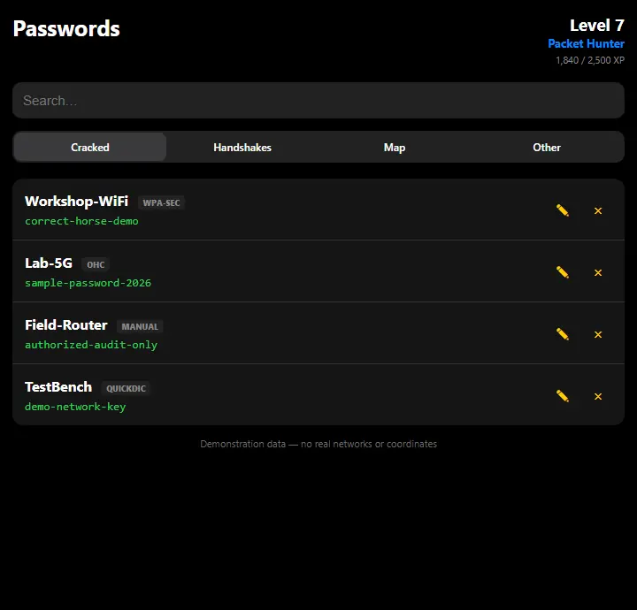
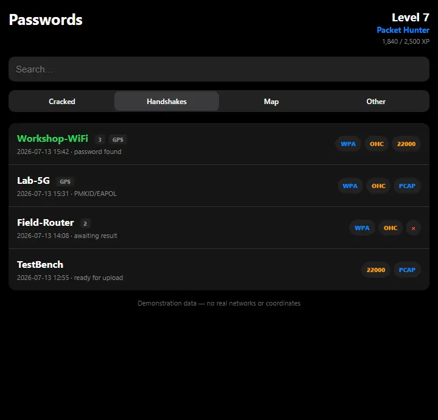
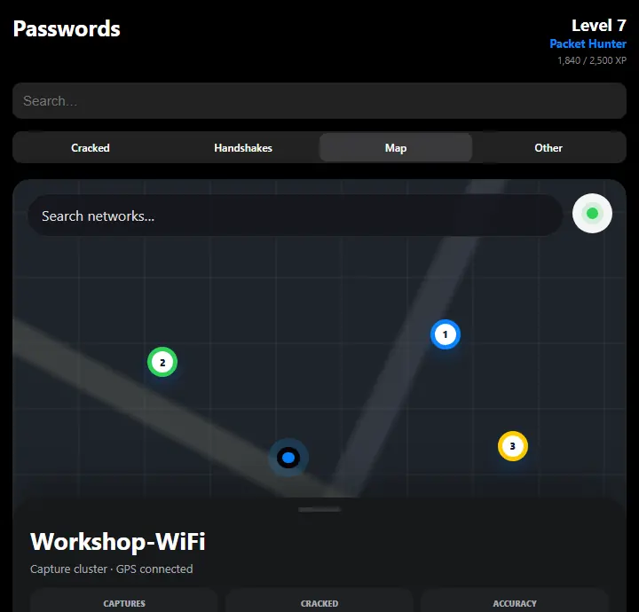

# PWMenu for Pwnagotchi

[](https://neewfpv.com/wiki/pwmenu)

[](https://github.com/newfpv/pwmenu/releases/latest)
[](https://github.com/newfpv/pwmenu/actions/workflows/test.yml)
[](./LICENSE)

PWMenu is a fast, mobile-first workflow manager for Pwnagotchi captures,
credentials, maps, WPA-sec, OnlineHashCrack, exports, and safe cleanup—all in
one Web UI.

<p align="center">
  
  
  
</p>

## Highlights

- Responsive **Cracked**, **Handshakes**, **Map**, and **Other** workspaces.
- Exact ESSID/BSSID matching without losing punctuation or creating duplicates.
- Local capture-quality checks and Hashcat mode 22000 conversion.
- Verified manual password entry for EAPOL and PMKID captures.
- Integrated WPA-sec and OnlineHashCrack queues with duplicate prevention.
- One best unresolved capture per BSSID in uncracked exports.
- GPS and manual map placement with clustering and whitelist controls.
- Confirmation-bound cleanup; files are never removed automatically.

## Quick install

```bash
sudo wget -O /usr/local/share/pwnagotchi/custom-plugins/A_pwmenu.py \
  https://raw.githubusercontent.com/newfpv/pwmenu/v1.3.9/A_pwmenu.py
```

Enable the plugin in `/etc/pwnagotchi/config.toml`:

```toml
main.plugins.A_pwmenu.enabled = true
```

Then restart only the Pwnagotchi service:

```bash
sudo systemctl restart pwnagotchi
```

Open `/plugins/A_pwmenu/` from the Pwnagotchi Web UI.

Installation requirements, updates, module switches, WPA-sec, OHC, VLESS/Xray,
quality grades, exports, map controls, cleanup, and troubleshooting are covered
in the **[complete PWMenu Wiki](https://neewfpv.com/wiki/pwmenu)**.

> Use PWMenu only with networks you own or have explicit permission to audit.
> Captures, credentials, network identifiers, and coordinates can contain
> sensitive information.

## Links

- [Wiki and setup guide](https://neewfpv.com/wiki/pwmenu)
- [Latest release](https://github.com/newfpv/pwmenu/releases/latest)
- [Changelog](./CHANGELOG.md)
- [Issues](https://github.com/newfpv/pwmenu/issues)

Licensed under [GPL-3.0](./LICENSE).
